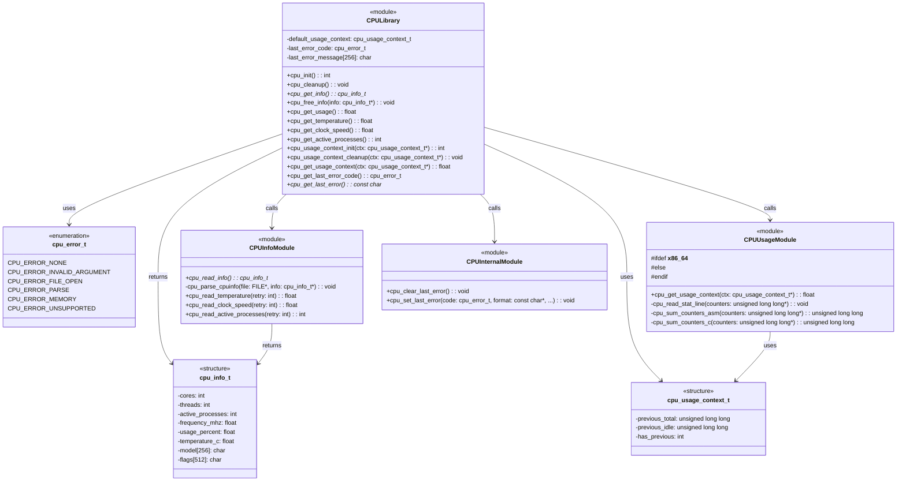
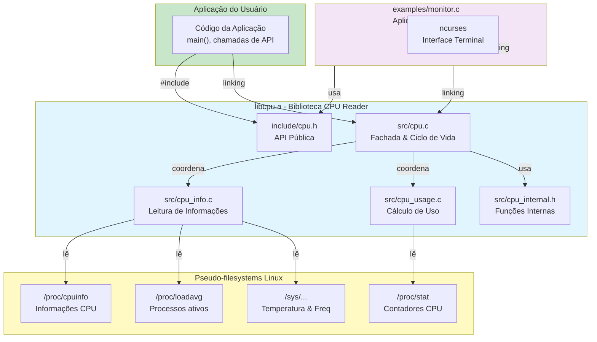
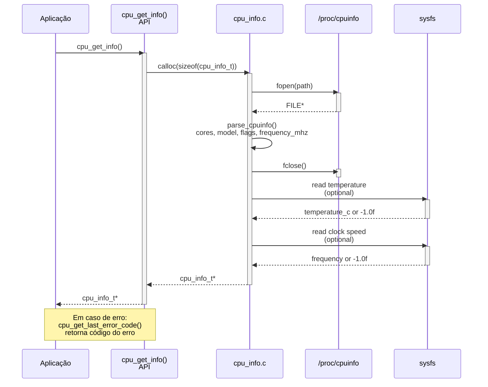
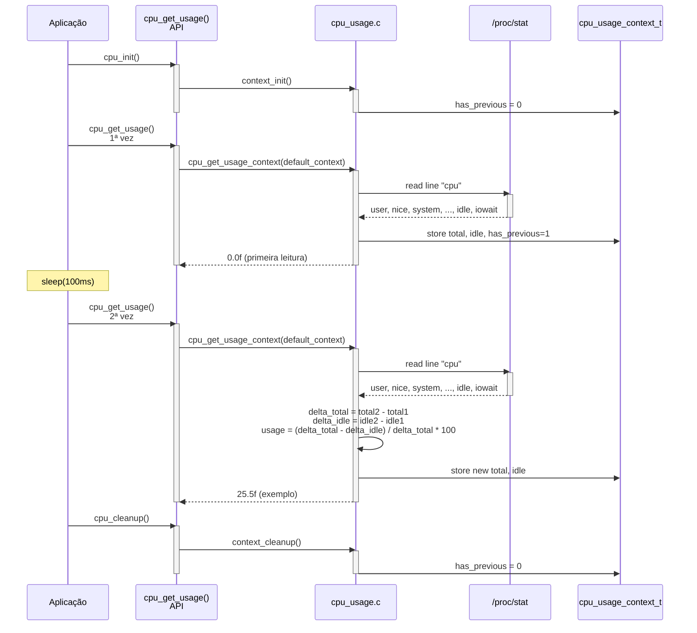
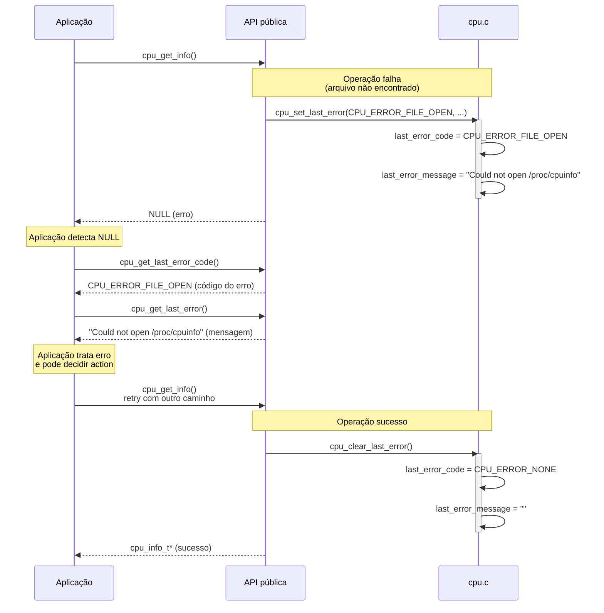
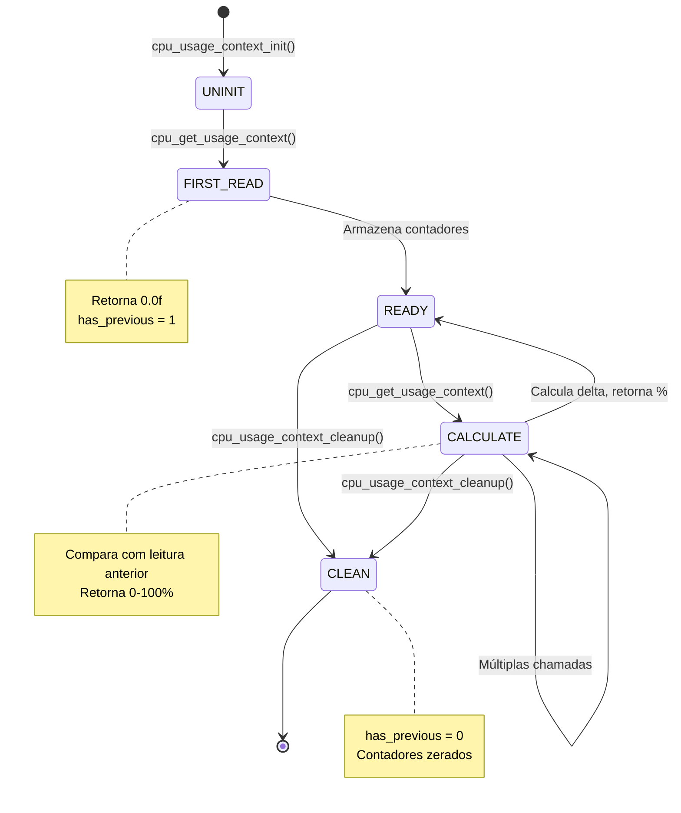
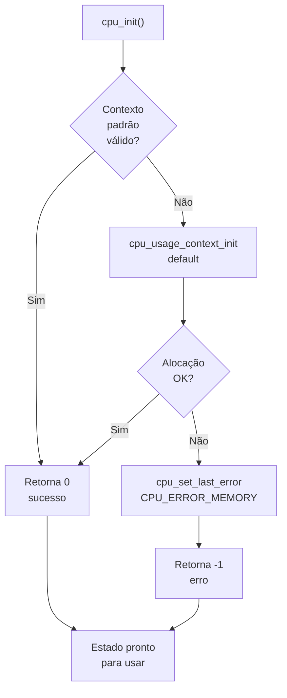
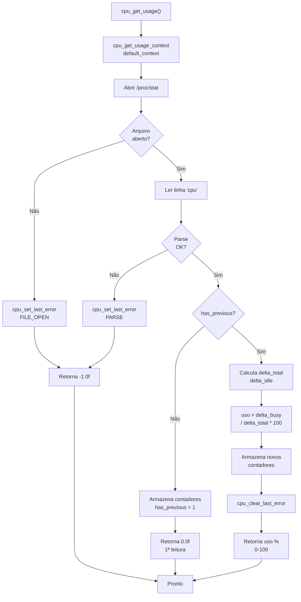
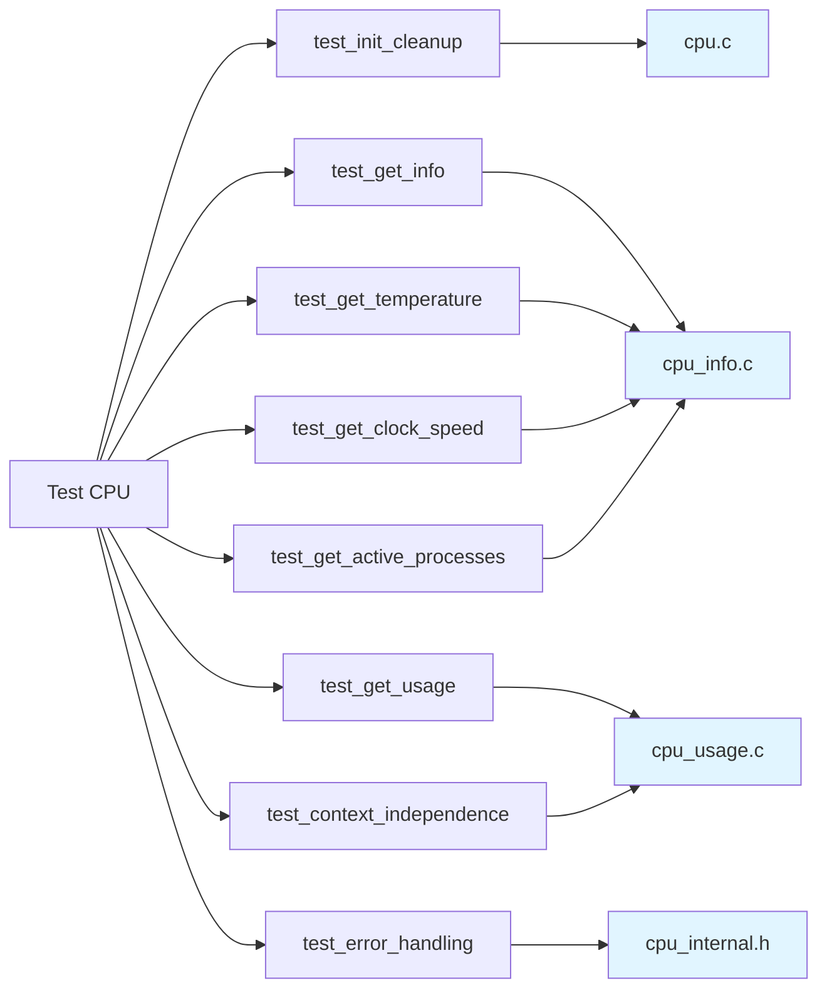
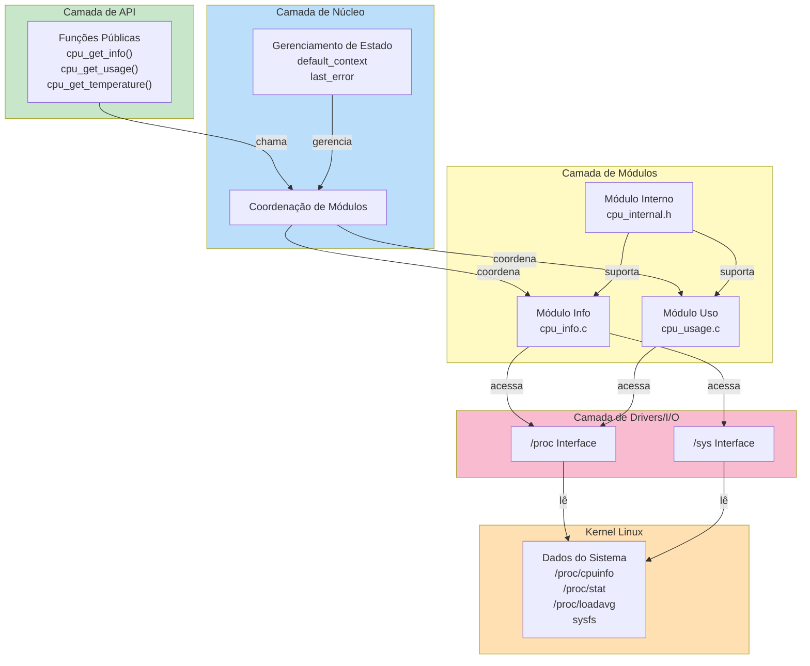

# Diagramas UML - CPU Reader

**Versão:** 0.1.1
**Data:** 2026-09-04  
**Formato:** Mermaid

---

## 1. Diagrama de Classes



---

## 2. Diagrama de Componentes



---

## 3. Diagrama de Sequência: Leitura de Informações



---

## 4. Diagrama de Sequência: Cálculo de Uso



---

## 5. Diagrama de Sequência: Tratamento de Erros



---

## 6. Diagrama de Estado: Contexto de Uso



---

## 7. Diagrama de Fluxo: Inicialização da Biblioteca



---

## 8. Diagrama de Fluxo: Obter Uso



---

## 9. Matriz de Responsabilidades (RACI)

| Componente         | Iniciar | Ler Info | Calcular Uso | Temperatura | Relatar Erro |
| ------------------ | ------- | -------- | ------------ | ----------- | ------------ |
| **cpu.c**          | R/A     | C        | C            | C           | R/A          |
| **cpu_info.c**     | -       | R/A      | -            | C           | -            |
| **cpu_usage.c**    | -       | -        | R/A          | -           | -            |
| **cpu_internal.h** | -       | -        | -            | -           | R/A          |

**Legenda:** R=Responsável, A=Accountable, C=Consultado

---

## 10. Mapa de Testes por Componente



---

## 11. Hierarquia de Chamadas (Call Graph)

```
cpu_init()
├── cpu_usage_context_init()
│   └── calloc()
└── return 0

cpu_get_info()
├── calloc(cpu_info_t)
├── fopen(path_from_env or /proc/cpuinfo)
├── cpu_parse_cpuinfo()
│   ├── fgets()
│   └── sscanf()
├── cpu_read_active_processes()
│   └── fopen(/proc/loadavg)
├── cpu_read_temperature()
│   └── fopen(sysfs_path)
├── cpu_read_clock_speed()
│   ├── fopen(sysfs_path)
│   └── [fallback] /proc/cpuinfo
├── sysconf(_SC_NPROCESSORS_ONLN)
├── fclose()
└── return cpu_info_t*

cpu_get_usage()
└── cpu_get_usage_context(&default_context)
    ├── fopen(path_from_env or /proc/stat)
    ├── fgets(line_cpu)
    ├── sscanf() ou cpu_sum_counters_asm/c()
    ├── fclose()
    ├── delta calculation
    └── return float

cpu_cleanup()
└── cpu_usage_context_cleanup()
    └── free(if needed)
```

---

## 12. Diagrama de Camadas



---

## 13. Árvore de Dependências

```
libcpu.a
├── include/cpu.h
│   ├── cpu_error_t (enum)
│   ├── cpu_info_t (struct)
│   ├── cpu_usage_context_t (struct)
│   └── 13 function declarations
│
├── src/cpu.c
│   ├── #include "cpu_internal.h"
│   ├── default_usage_context (static)
│   ├── last_error_code (static)
│   ├── last_error_message (static)
│   └── calls to cpu_usage_context_init/cleanup, etc.
│
├── src/cpu_info.c
│   ├── #include "cpu_internal.h"
│   ├── cpu_read_info()
│   ├── cpu_parse_cpuinfo()
│   ├── cpu_read_temperature()
│   ├── cpu_read_clock_speed()
│   └── cpu_read_active_processes()
│
├── src/cpu_usage.c
│   ├── #include "cpu_internal.h"
│   ├── cpu_get_usage_context()
│   ├── cpu_read_stat_line()
│   ├── #ifdef __x86_64__ cpu_sum_counters_asm()
│   └── cpu_sum_counters_c()
│
└── src/cpu_internal.h
    ├── cpu_clear_last_error()
    ├── cpu_set_last_error()
    ├── Function declarations
    └── Shared constants

Linux POSIX
├── <stdio.h> (fopen, fgets, fclose)
├── <stdlib.h> (malloc, free, calloc)
├── <string.h> (strlen, strcpy)
├── <unistd.h> (sysconf)
└── <sys/sysinfo.h> (optional)

examples/monitor.c
├── #include <cpu.h> (libcpu.a)
├── #include <ncurses.h> (optional)
└── Linux POSIX

tests/test_cpu.c
├── #include <cpu.h> (libcpu.a)
└── Linux POSIX
```

---

## 14. Visão Geral dos Diagramas

| Diagrama     | Tipo           | Foco               | Audiência          |
| ------------ | -------------- | ------------------ | ------------------ |
| Classes      | Estrutural     | Tipos e funções    | Desenvolvedores    |
| Componentes  | Estrutural     | Módulos e deps     | Arquitetos         |
| Seq. Leitura | Comportamental | Fluxo de I/O       | QA/Desenvolvedores |
| Seq. Uso     | Comportamental | Cálculo de delta   | Desenvolvedores    |
| Seq. Erro    | Comportamental | Tratamento de erro | QA/Desenvolvedores |
| Estado       | Comportamental | Ciclo de vida      | Arquitetos         |
| Fluxo Init   | Comportamental | Inicialização      | Desenvolvedores    |
| Fluxo Uso    | Comportamental | Decisões           | Desenvolvedores    |
| RACI         | Organizacional | Responsabilidades  | Gerência           |
| Testes       | Estrutural     | Cobertura          | QA                 |
| Call Graph   | Estrutural     | Hierarquia         | Desenvolvedores    |
| Camadas      | Arquitetural   | Estrutura          | Arquitetos         |
| Dependências | Estrutural     | Linkagem           | Build/DevOps       |

---

**Nota:** Todos os diagramas podem ser renderizados com Mermaid (markdown) ou ferramentas como PlantUML, Lucidchart, etc.
