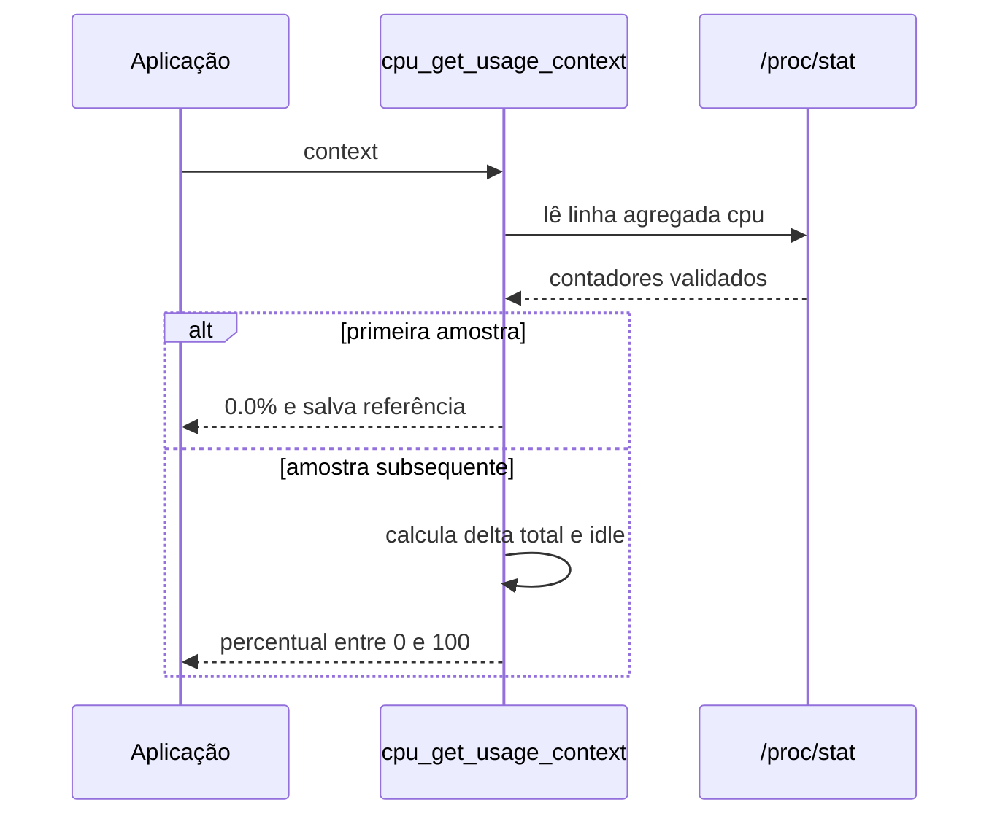

# Diagramas UML — CPU Reader

**Escopo:** arquitetura implementada na branch principal, após a separação do
módulo de telemetria.

## Componentes

```mermaid
flowchart TD
    APP[Aplicação consumidora / monitor ncurses]
    API[include/cpu.h — API pública]
    FACADE[src/cpu.c — wrappers, parsing comum e estado legado por thread]
    INFO[src/cpu_info.c — modelo e topologia]
    TELEMETRY[src/cpu_telemetry.c — temperatura, clock e loadavg]
    USAGE[src/cpu_usage.c — deltas de /proc/stat]
    INTERNAL[src/cpu_internal.h — contratos internos]
    PROCINFO[/proc/cpuinfo]
    PROCSTAT[/proc/stat]
    LOADAVG[/proc/loadavg]
    SYSFS[sysfs — thermal e cpufreq]

    APP --> API
    API --> FACADE
    FACADE --> INFO
    FACADE --> TELEMETRY
    FACADE --> USAGE
    INFO --> INTERNAL
    TELEMETRY --> INTERNAL
    USAGE --> INTERNAL
    INFO --> PROCINFO
    TELEMETRY --> LOADAVG
    TELEMETRY --> SYSFS
    USAGE --> PROCSTAT
```

## Tipos públicos

```mermaid
classDiagram
    class cpu_info_t {
        +int logical_processors
        +int physical_cores
        +float current_frequency_mhz
        +int cores
        +int threads
        +int active_processes
        +float frequency_mhz
        +float usage_percent
        +float temperature_c
        +char model[256]
        +char flags[512]
    }
    class cpu_usage_context_t {
        +unsigned long long previous_total
        +unsigned long long previous_idle
        +int has_previous
    }
    class cpu_error_info_t {
        +cpu_error_t code
        +char message[256]
    }
    class cpu_error_t {
        <<enumeration>>
        CPU_ERROR_NONE
        CPU_ERROR_INVALID_ARGUMENT
        CPU_ERROR_FILE_OPEN
        CPU_ERROR_PARSE
        CPU_ERROR_MEMORY
        CPU_ERROR_UNSUPPORTED
    }
    cpu_info_t : heap allocated; caller releases with cpu_free_info
    cpu_usage_context_t : caller-owned; external synchronization if shared
```

## Ciclo de uma amostra de uso



## Contratos de estado

- `cpu_get_info()` devolve um snapshot alocado; o consumidor chama
  `cpu_free_info()`.
- `logical_processors` conta entradas `processor` no arquivo de CPU. O campo
  legado `threads` representa `sysconf(_SC_NPROCESSORS_ONLN)`; podem divergir.
- `physical_cores` conta pares únicos `physical id`/`core id`; zero significa
  que não há informação de topologia física suficiente.
- O contexto padrão de `cpu_get_usage()` e o diagnóstico legado são locais à
  thread em GCC/Clang. Contextos explícitos compartilhados precisam de
  sincronização externa.
- A API de erro baseada em "último erro" é legada; variantes `*_ex` copiam o
  diagnóstico para `cpu_error_info_t` pertencente ao chamador.
